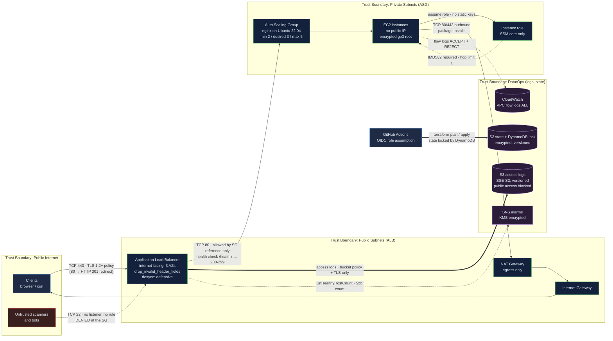

# AWS Terraform Game Day: Production-grade infrastructure, taught by breaking it

[](https://github.com/Freddricklogan/aws-terraform-gameday/actions/workflows/deploy.yml)
[](AUDIT.md#verification-actually-performed-in-this-pass)
[](https://github.com/Freddricklogan/aws-terraform-gameday/actions/workflows/codeql.yml)
[](LICENSE)
[](https://freddricklogan.github.io/aws-terraform-gameday/)

> The policy-scan badge is a measured Checkov result over the root module and
> `modules/`, not code coverage — Terraform has no meaningful line-coverage
> metric. The exact command and output are in [AUDIT.md](AUDIT.md).

---

## 1. Executive Summary & Business Impact

**Problem.** Infrastructure engineers are hired on their ability to reason about
a system that is already on fire, but they are trained on tutorials where
everything works. The gap shows up at the worst possible moment: a load balancer
returns 503, the Terraform apply reported success, and nobody can say why. At the
same time, the configurations people learn from routinely ship patterns that
would fail a security review — SSH open to the world, unencrypted volumes,
compute in public subnets, no logging, state on a laptop.

**Solution.** This repository is two things held deliberately together:

1. **A hardened reference implementation.** A three-tier AWS stack — internet-facing
   ALB in public subnets, Auto Scaling group in private subnets, logging and state
   in a separate boundary — composed from four Terraform modules with pinned
   providers, validated variables, a consistent tagging strategy, and a CI
   pipeline that lints, tests, scans and gates every apply behind a human.

2. **A Game Day curriculum.** Six broken-infrastructure challenges with graduated
   hints, worked solutions and a scoring rubric that rewards diagnosis over
   speed, plus a facilitator guide for running a three-hour session.

**Value delivered.** Against the original configuration, the refactor closes
every finding a policy scanner raises, and it does so in a form a team can
actually verify: Checkov goes from **28 passed / 20 failed** to **148 passed /
0 failed / 16 documented exceptions**, and the security posture is re-asserted on
every commit by `terraform test` running against mocked providers — no AWS
account, no credentials, no spend. The teaching material is preserved intact:
`challenges/` is excluded from CI precisely so that a green build never depends
on someone un-breaking the curriculum.

The measured numbers above, and an explicit list of what was *not* run in this
pass, are in [AUDIT.md](AUDIT.md).

**[→ Read the full case study](docs/CASE_STUDY.md)**

---

## 2. Demonstrated Competencies & Technical Skills

**Systems Architecture & CS.** Four-boundary network design with the blast radius
drawn deliberately: exactly one internet-facing component, compute with no public
address and no inbound path except a security group reference, and NAT egress
that is cost-bounded by a flag. The composition is four modules
(`network`, `compute`, `alb`, `observability`) wired by a root file that contains
no resources of its own, so the whole stack reads top-to-bottom in about ninety
seconds. Subnet CIDRs are derived with `cidrsubnet()` rather than hand-maintained,
which removes an entire class of index-out-of-range failures. Capacity is
constrained by cross-variable validation (`min_size ≤ desired_capacity ≤ max_size`),
a Terraform 1.9 feature that turns a five-minute apply failure into a one-second
plan failure.

**Data Science & AI.** n/a. This repository provisions infrastructure and teaches
diagnosis; it contains no models, datasets or inference paths, and inventing one
would be worse than saying so.

**Cybersecurity & Compliance.** Defence in depth applied at each layer and, more
importantly, made *checkable*: IMDSv2 required with a metadata hop limit of 1
(so an SSRF in the web tier cannot reach the instance role); no port 22 anywhere,
with operator access via IAM-authenticated, CloudTrail-logged Session Manager;
security groups that reference each other by ID rather than by CIDR; encrypted
gp3 root volumes; ALB access logs to a versioned, public-access-blocked,
TLS-only S3 bucket; VPC flow logs capturing `ACCEPT` **and** `REJECT`; least-privilege
IAM scoped to a single log group ARN; remote state with DynamoDB locking; and
GitHub OIDC role assumption so no long-lived AWS key exists in the repository or
its secrets. Every scanner exception is an inline annotation with a written
reason — `grep -rn "checkov:skip="` reviews all sixteen in one screen — because
a suppression without a justification is just a hidden finding.

**EdTech & Human-Centered Design.** The Game Day pedagogy is the point, not a
side effect. Learners are handed a **symptom** rather than a stack trace — "the
URL returns 503", "requests time out with no error" — because that is the input
real incidents provide. Defects are planted one concept at a time and sequenced
from two-bug beginner routing to a four-bug unhinted boss level, so difficulty
rises without ever becoming ambiguous. **Hints are graduated and costly**: three
per challenge, escalating from nudge to mechanism to answer, hidden behind a
toggle on the console page so revealing one is a decision a team makes together,
and scored at −100/−200/−400. **Solutions are separate files** that explain root
cause and lesson rather than just the diff, so reading one after solving still
teaches. The scoring rubric pays 1000 for a solved challenge *with* a correct
root-cause explanation and only 600 without it, pays a bonus for predicting the
symptom before applying, and penalises leaving resources running — encoding cost
discipline as a graded competency. The debrief protocol ends on the transferable
question ("what would have caught this before the apply?") and answers it by
pointing at the `terraform test` assertions that cover the very defects the
challenges teach.

---

## 3. System Architecture & Data Flow



**Reading the boundaries.** Only one edge in this diagram is reachable without a
credential: the ALB listener. Everything crossing into the private subnets is
permitted by *security group reference*, not by CIDR — there is no IP range that
grants access to the application tier, only membership of the ALB's security
group. Everything crossing into the data/ops boundary is one-way: the ALB and the
VPC write logs there and can read nothing back, and Terraform state is reachable
only by a role assumed through GitHub's OIDC provider. The dotted line from the
untrusted scanners is the control that does not exist as a resource: port 22 has
no listener and no rule anywhere in the configuration.

---

## 4. Technical Highlights & Engineering Decisions

### ADR-1 — Pin the provider to `~> 5.60` and commit the lock file, against an inherited `~> 6.0`

**Context.** The original `provider.tf` declared `aws ~> 6.0` while the
configuration used 5.x-era idioms throughout, and `.terraform.lock.hcl` was
listed in `.gitignore`. There was no `required_version` at all, so any Terraform
from 0.12 upward would attempt the configuration. Two facilitators cloning the
same commit a week apart could resolve different provider builds — and, because
of an unpinned `most_recent` AMI filter, different operating systems too.

**Decision.** Pin `required_version = ">= 1.9.0, < 2.0.0"` and `aws ~> 5.60` in a
`versions.tf` at the root *and* in every module; remove `.terraform.lock.hcl`
from `.gitignore` and commit it; resolve the AMI from Canonical's published SSM
public parameter for Ubuntu 22.04 LTS rather than a `most_recent` filter. The
1.9 floor is not arbitrary — cross-variable `validation` blocks and
`terraform test` provider mocking both require it, and both are used here.

**Consequence.** A clone is reproducible: same provider build, same checksums,
same AMI per region. The cost is a deliberate upgrade step — moving to AWS
provider 6.x becomes a reviewed pull request with a plan diff attached, rather
than something that happens silently on whichever machine runs `init` next. For a
repository whose entire purpose is that people can trust what it deploys, that is
the right trade.

### ADR-2 — Move compute to private subnets and delete SSH entirely, accepting a NAT gateway bill

**Context.** Every subnet was public, `map_public_ip_on_launch` was `true`, the
Auto Scaling group launched straight into them, and a single security group —
shared by the ALB *and* the instances — allowed `0.0.0.0/0` on ports 22 and 80
with unrestricted egress. Each instance had its own internet-routable address, so
the load balancer was decorative as a security control: you could address the
targets directly and bypass it. The counter-argument is real: public subnets are
free, and a NAT gateway is roughly USD 32/month plus data processing.

**Decision.** Two tiers. Public subnets hold only the ALB and the NAT gateway,
with `map_public_ip_on_launch = false`. Private subnets hold the Auto Scaling
group with `associate_public_ip_address = false` and no route to an internet
gateway. The shared security group is split in two, each referencing the other by
ID. Port 22 is removed from the configuration entirely; operator access is
Session Manager via `AmazonSSMManagedInstanceCore`. Cost is bounded by
`single_nat_gateway = true` by default (one gateway instead of three, roughly a
third of the NAT spend, at the price of AZ independence for outbound traffic),
and the flag is documented at its declaration site rather than buried.

**Consequence.** There is no longer a network path from the internet to anything
that runs application code, and no SSH daemon to defend, rotate keys for, or
explain in a review. Session Manager access is IAM-authenticated and CloudTrail-logged,
which is strictly better evidence than an `authorized_keys` file. The costs are
honest: a NAT gateway now bills hourly whether or not anyone is using it, teardown
matters more than it used to (hence the scored penalty for leaving resources
running), and debugging requires the AWS CLI with the Session Manager plugin
rather than `ssh`. For a Game Day that runs for a day and is destroyed, that is
acceptable; the guide's closing checklist exists specifically to enforce it.

### ADR-3 — Prove the hardening with `terraform test` and mocked providers, not with Terratest

**Context.** None of the security properties that matter here are visible in a
`terraform validate` run. `validate` is happy to accept IMDSv1, an unencrypted
volume, or an ASG that was never registered with a target group. The conventional
answer is Terratest: real Go tests that apply real infrastructure and assert
against it. That gives the highest-fidelity signal available — and it needs an AWS
account, credentials in CI, ten-minute runs and a real bill, for a repository
whose readers are mostly students and reviewers who have neither.

**Decision.** Use the native `terraform test` framework with `mock_provider` and
per-data-source `mock_data` defaults. Three files: variable-validation runs that
assert bad inputs are *rejected* (a validation block that never fires is
indistinguishable from no validation at all), module-scoped runs that re-root
Terraform at `./modules/<name>` so individual resources are addressable and can be
asserted directly, and a root composition smoke test. Every run is `command = plan`
against mocks, so no credentials are configured for the `test` CI job at all — it
*cannot* reach AWS by construction.

**Consequence.** Deleting `http_tokens = "required"`, flipping `health_check_type`
to `EC2`, dropping `target_group_arns`, or turning off ALB access logs each turns
CI red in seconds, at zero cost, on a fork with no AWS account. That is what makes
the "zero-cost review path" in section 6 possible, and it is why a reviewer can
verify the claims in this README without trusting them. The honest limitation:
these are *plan-time* assertions. They prove the configuration requests the right
thing; they cannot prove AWS did it. End-to-end verification still needs a real
apply, and a production deployment of this stack should add exactly that as a
separate, credentialed job.

---

## 5. Getting Started & Verification

**Prerequisites.** Terraform ≥ 1.9 and git. Everything in this section runs
without an AWS account, without credentials, and without spending anything.
tflint, checkov and trivy are needed only for `make lint` / `make scan`.

```bash
git clone https://github.com/Freddricklogan/aws-terraform-gameday
cd aws-terraform-gameday

# Install a pinned, checksum-verified Terraform (Ubuntu/Debian)
bash scripts/setup-terraform.sh

# Check the workstation
bash scripts/validate.sh
```

**One command each:**

```bash
make init     # terraform init -backend=false
make lint     # terraform fmt -check, validate (root + each module), tflint
make test     # terraform test -- mocked providers, no AWS calls, no cost
make scan     # checkov + trivy config
make help     # every target
```

Run `make help` for the full list; `make plan`, `make apply` and `make destroy`
are the only targets that touch AWS.

**Deploying for real** (optional — a Game Day can be run entirely without this):

```bash
cp terraform.tfvars.example terraform.tfvars    # edit; it is git-ignored
cp backend.tf.example backend.tf                # fill in your bucket and lock table
terraform init
make plan
make apply
# ... and when you are done, always:
make destroy
```

**Pre-commit hooks** (`terraform_fmt`, `validate`, `tflint`, `checkov`, `trivy`,
`terraform_docs`, `gitleaks`, `shellcheck`, all pinned):

```bash
pip install pre-commit && pre-commit install
make pre-commit
```

**Repository layout**

```
├── main.tf                     root composition — four modules, no resources
├── versions.tf                 terraform >= 1.9, aws ~> 5.60
├── providers.tf                default_tags; credentials from the default chain
├── variables.tf                every variable typed, described and validated
├── backend.tf.example          S3 + DynamoDB locking, placeholder values only
├── modules/
│   ├── network/                VPC, public + private subnets, NAT, flow logs
│   ├── compute/                launch template (IMDSv2, encrypted EBS) + ASG
│   ├── alb/                    ALB, target group, both security groups, alarms
│   └── observability/          log bucket, log group + IAM role, SNS topic
├── tests/                      *.tftest.hcl — mocked, offline, free
├── challenges/                 6 broken configs (excluded from CI on purpose)
├── solutions/                  6 root-cause write-ups
├── docs/
│   ├── index.html              the Game Day console (published to Pages)
│   ├── GAMEDAY_FACILITATOR_GUIDE.md
│   └── *.md                    AWS concepts, Terraform guide, troubleshooting…
├── .github/workflows/          deploy.yml (CI/CD + Pages), codeql.yml
└── AUDIT.md                    findings, fixes, residual risks, what was run
```

---

## 6. Live Demo & Production Showcase

**There is no live AWS demo, and there will not be one.** This stack costs money
to run — a NAT gateway and an ALB bill by the hour whether or not anyone visits —
and a permanently deployed environment that exists only to be looked at is
exactly the habit this repository penalises in its own scoring rubric. What is
published is the console page, which is static.

**[Game Day Console →](https://freddricklogan.github.io/aws-terraform-gameday/)**
— the architecture, all six challenges with difficulty and hint toggles, links to
every solution, and the control inventory. Built for a 30-second scan. Press
**Take the 30-second tour** for a five-step guided walkthrough (Esc closes, arrow
keys step). No account, no backend, no network calls.

### Zero-cost review path

Everything below runs on a laptop with no AWS account and no credentials.

```bash
git clone https://github.com/Freddricklogan/aws-terraform-gameday
cd aws-terraform-gameday

make init     # terraform init -backend=false  — downloads the provider, nothing else
make test     # terraform test — mock_provider answers every read
make scan     # checkov + trivy config
```

`make test` is the interesting one. The suite has three files:
`variable_validation.tftest.hcl` (17 runs proving bad inputs are rejected),
`security_hardening.tftest.hcl` (module-scoped plan assertions on IMDSv2,
encryption, public IPs, SG references, ELB health checks, target group
registration, access logging, TLS policy) and `root_composition.tftest.hcl`
(three whole-stack plans). No credentials are configured for it in CI, so it
cannot reach AWS even if something tried.

**To see a real plan without an AWS account**, either point Terraform at
LocalStack:

```bash
docker run --rm -d -p 4566:4566 --name localstack localstack/localstack:3
cat > localstack_override.tf <<'EOF'
provider "aws" {
  region                      = "us-east-2"
  access_key                  = "test"
  secret_key                  = "test"
  s3_use_path_style           = true
  skip_credentials_validation = true
  skip_metadata_api_check     = true
  skip_requester_account_id_validation = true
  endpoints {
    ec2 = "http://localhost:4566"
    elbv2 = "http://localhost:4566"
    s3 = "http://localhost:4566"
    iam = "http://localhost:4566"
    sts = "http://localhost:4566"
    logs = "http://localhost:4566"
    sns = "http://localhost:4566"
    ssm = "http://localhost:4566"
    autoscaling = "http://localhost:4566"
  }
}
EOF
terraform init && terraform plan
# remember to delete localstack_override.tf afterwards
```

— or simply run the `plan` job by hand (Actions -> CI/CD -> Run workflow) and
read the diff in the run summary
(`deploy.yml`, job `plan`).

### What was actually verified, and what was not

Honesty matters more here than a screenshot. **No `terraform plan` output is
reproduced in this README, because none was produced.** The sandbox this refactor
was written in cannot reach `releases.hashicorp.com` or `github.com` — both
return `403` at the egress proxy — so Terraform, tflint and Trivy could not be
installed, and `terraform init`, `validate`, `fmt -check` and `test` were
therefore **not executed** against this tree. They run as the first two CI jobs.

What *was* run, for real, from PyPI:

```
$ checkov --directory . --config-file .checkov.yaml --compact
terraform scan results:
Passed checks: 148, Failed checks: 0, Skipped checks: 16

$ checkov -d challenges/ --compact          # the deliberately broken teaching configs
Passed checks: 51, Failed checks: 39, Skipped checks: 0

$ checkov -f <original main.tf provider.tf variables.tf outputs.tf>   # the baseline
Passed checks: 28, Failed checks: 20, Skipped checks: 0
```

plus an HCL2 parse of all 30 `.tf` and `.tftest.hcl` files (0 failures). The full
tool-by-tool table, including every row marked "No", is in
[AUDIT.md](AUDIT.md#verification-actually-performed-in-this-pass).

### 30-second reviewer walkthrough

1. Open the [console](https://freddricklogan.github.io/aws-terraform-gameday/) and
   read the four trust boundaries in the diagram.
2. Press **Take the 30-second tour** and step through with the arrow keys.
3. Expand the hints on Challenge 2 — that is the pedagogy in one click:
   graduated, costly, hidden by default.
4. Open [`tests/security_hardening.tftest.hcl`](tests/security_hardening.tftest.hcl)
   and read three assertions. Those are the security claims, in executable form.
5. Open [AUDIT.md](AUDIT.md) and skip to **Residual risks** — the part that says
   what is still wrong.

---

## Game Day Results — March 13, 2026

Competed in the **AWS GameDay with Terraform** hosted by Illinois Tech's College
of Computing. Completed all quests under time pressure.

### Intro to Terraform with HashiCorp (HashiCafe Quest)

| Task | Challenge | Resolution | Points |
|------|-----------|------------|--------|
| 1 | Configure remote state with S3 | Added an S3 backend block to `terraform.tf`, ran `terraform init` to migrate state, deployed 41 resources including CloudFront, API Gateway, Lambda, DynamoDB and S3 | 25,000 |
| 2 | Fix an S3 bucket policy misconfiguration | Identified that the policy granted `s3:ListBucket` instead of `s3:GetObject`, preventing CloudFront from serving static files. Fixed the IAM action and redeployed | 25,000 |
| 3 | Restore infrastructure after a crash | Detected via `terraform plan` that API Gateway resources had been deleted outside Terraform. Ran `terraform apply` to reconcile drift and restore the deployment | 25,000+ |
| 4 | Terraform knowledge questions | Answered correctly: `terraform fmt` is the standard formatting method | Bonus |

**Final score (HashiCafe): 120,755 points**

**Key takeaways** — remote state is not optional for a team; `terraform plan`
detects drift caused by console clicks and `apply` reconciles it; `s3:ListBucket`
versus `s3:GetObject` is the difference between a working site and Access Denied;
CloudFront distributions take 3–5 minutes to create. Task 1 of that quest is the
direct ancestor of [`backend.tf.example`](backend.tf.example) in this repository.

---

## Documentation

| Document | What it covers |
|---|---|
| [AUDIT.md](AUDIT.md) | Every finding, fix, residual risk, and what was actually verified |
| [Facilitator Guide](docs/GAMEDAY_FACILITATOR_GUIDE.md) | Running a session: shapes, timing, scoring, failure modes |
| [Challenges](challenges/README.md) | The six exercises, the debugging sequence, the attach pattern |
| [Setup Guide](docs/setup-guide.md) | AWS account, CLI, Terraform and editor setup |
| [AWS Concepts](docs/aws-concepts.md) | VPC, subnets, security groups, ALB, ASG explained |
| [Terraform Guide](docs/terraform-guide.md) | Commands, block types, references, loops |
| [Troubleshooting](docs/troubleshooting.md) | The attach pattern, common errors, debug commands |
| [Game Day Prep](docs/gameday-prep.md) | Event details, study plan, bookmarks |
| [Cheat Sheet](docs/cheat-sheet.md) | Printable quick reference |

## References

- [Terraform AWS Provider](https://registry.terraform.io/providers/hashicorp/aws/latest/docs)
- [Terraform language reference](https://developer.hashicorp.com/terraform/language)
- [`terraform test` and provider mocking](https://developer.hashicorp.com/terraform/language/tests)
- [AWS VPC User Guide](https://docs.aws.amazon.com/vpc/latest/userguide/)
- [IMDSv2 and instance metadata](https://docs.aws.amazon.com/AWSEC2/latest/UserGuide/configuring-instance-metadata-service.html)
- [Configuring OpenID Connect in AWS for GitHub Actions](https://docs.github.com/en/actions/deployment/security-hardening-your-deployments/configuring-openid-connect-in-amazon-web-services)
- [Course reference (ITMT-430)](https://github.com/illinoistech-itm/jhajek/tree/master/itmt-430)

## Author

**Freddrick Logan** — Illinois Institute of Technology, ITMT-430
· [GitHub](https://github.com/Freddricklogan)
· [Portfolio](https://fredlogan.phd)

Licensed under the [MIT License](LICENSE).
